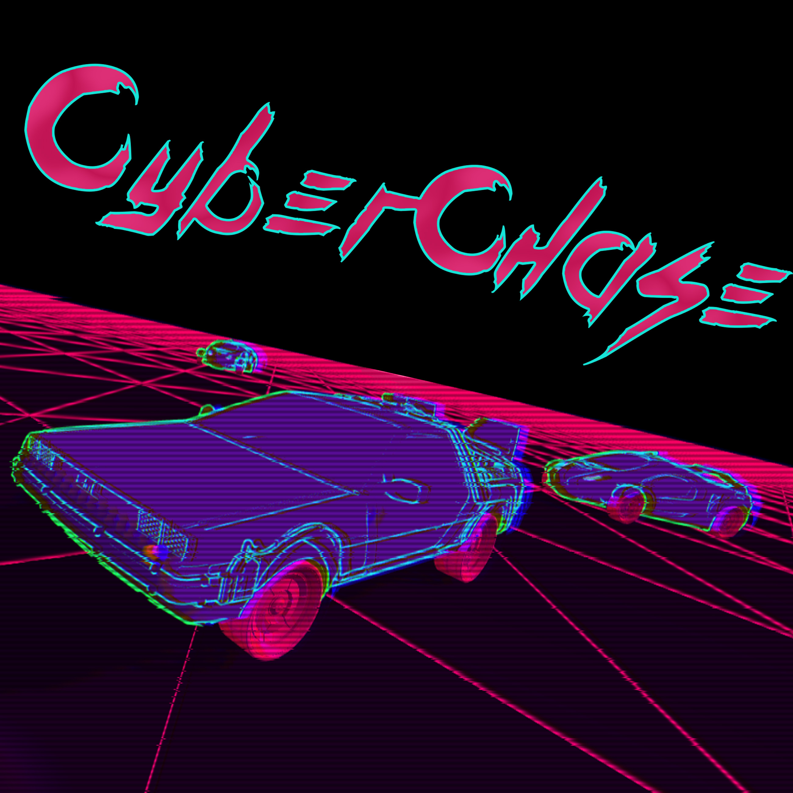
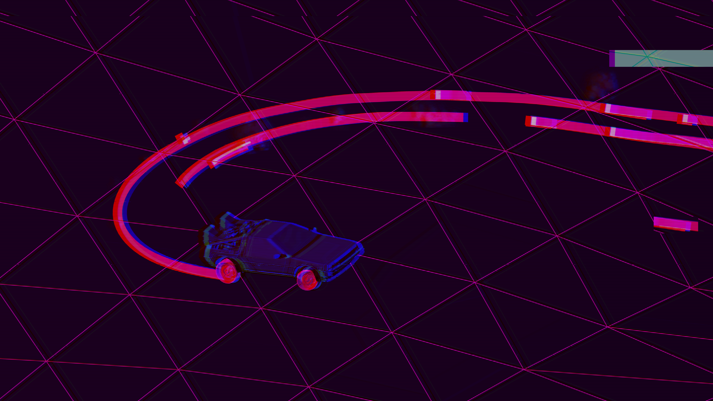

<h1>Cyber-Chase</h1>

Cyber-Chase was my very first solo project, originally created in 2018 using Unity.
It started as a personal learning challenge, built from a mix of tutorials and study materials.

Set in a retrofuturistic world inspired by synthwave, vaporwave, and 80s VHS aesthetics,
Cyber-Chase is a simple arcade-style game where the player must outrun the police through neon-lit streets.

The purpose of this archive is to preserve the first functional game I ever made and keep it playable on modern versions of Unity.
The original gameplay and visual identity remain intact, while selected legacy systems have been modernized and small quality-of-life and reliability improvements have been introduced.

Main goals of this repository:
* Preserving the project as a milestone of my early development journey.
* Keeping the game functional on modern versions of Unity.
* Maintaining its original retro visual style and synthwave atmosphere.
* Carefully modernizing legacy systems and improving gameplay without changing the character of the original project.
